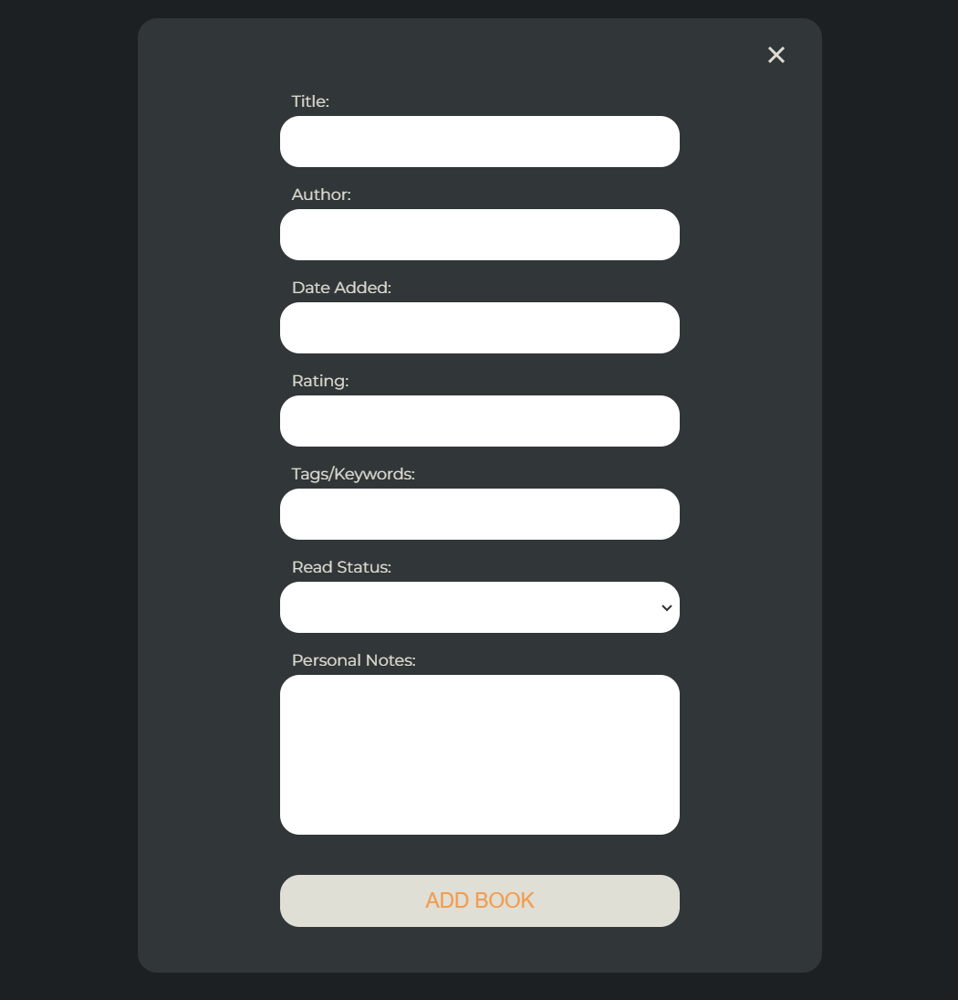
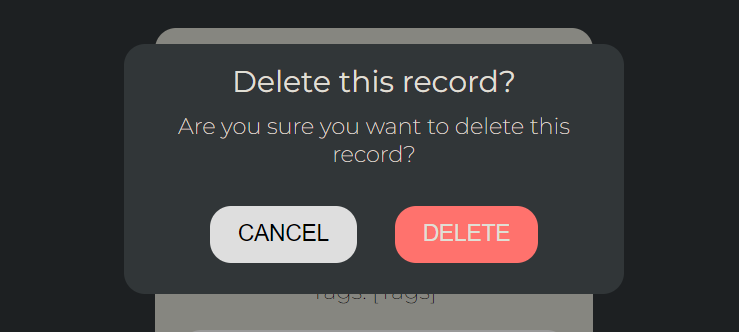
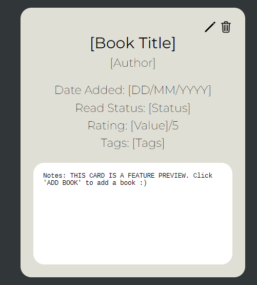

## Table of contents

- [Overview](#overview)
- [Javascript](#javascript-overview)
- [Data Storage](#data-storage)
- [UI](#modal-windows)
- [How to use](#usage)
- [Author](#author)

## Overview

"My library" is a web application used to store data on a users favorite books.

## Javascript Overview

### Objects

- Below I have highlighted two instances in which I used objects to store and data

  1. This was used to create the object for a new record

  - ```js
    const bookData = {
      bookTitle: titleInput.value,
      author: authorInput.value,
      date: addedDateInput.value,
      rating: ratingInput.value,
      tags: tagsInput.value,
      status: readStatusSelect.value,
      notes: personalNotesTextarea.value,
    };
    ```

  2.  This was used to populate the edit form with the records data

  - ```js
    const bookData = {
      bookTitle: bookCard.querySelector(".book-title").textContent,
      author: bookCard.querySelector(".author").textContent,
      date: bookCard
        .querySelector(".date-added")
        .textContent.replace("Date Added: ", ""),
      status: bookCard
        .querySelector(".read-status")
        .textContent.replace("Read Status: ", ""),
      rating: bookCard
        .querySelector(".rating")
        .textContent.replace("Rating: ", "")
        .split("/")[0],
      tags: bookCard.querySelector(".tags").textContent.replace("Tags: ", ""),
      notes: bookCard
        .querySelector(".notes p")
        .textContent.replace("Notes: ", ""),
    };
    ```

### Data Storage

1.  Deleting

    - Below is the main function responsible for storing the books object in local storage

      ```js
      const removeBookCard = (bookCard) => {
        if (bookCard && bookCard.parentElement) {
          const index = Array.from(bookCard.parentElement.children).indexOf(
            bookCard
          );
          const removedBook = allBooks.splice(index, 1)[0];

          localStorage.setItem("allBooks", JSON.stringify(allBooks));
          bookCard.parentElement.removeChild(bookCard);
        }
      };
      ```

2.  Saving
    - Below is the logic that saves data to local storage
      ```js
      localStorage.setItem("allBooks", JSON.stringify(allBooks));
      ```

## Modal Windows

The program contains two modal windows

1. The "ADD BOOK" modal
   - This modal is a form which is used to create new book records
     - It contains four required and three optional fields
       
2. The delete confirmation modal
   - This modal is a popup which confirms that the user wants to delete a record
     

## Book Card

Each book record has its own card with various properties as well as a edit and delete button



## Usage

- creating new entry

  - click add book
  - fill in the required information
  - click add book button in the modal window to add the book to the data base

- editing entry

  - click on the pen icon and edit accordingly

- deleting entry
  - click on the trash icon and confirm delete

## Author

- Website - [Nikesh Cohen](https://www.your-site.com)
- Twitter - [@nikeshcohen](https://www.twitter.com/nikeshcohen)
